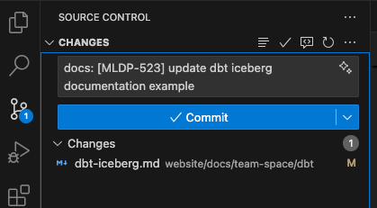

# vibe conventional commit

Folow this commit structure:

```
<type>(<scope>): [<JIRA-1234>]<subject>
```

Copilot will get the jira ticket from the branch name.

Open VSCode settings (JSON) and add the following:

```json
{
    "github.copilot.chat.commitMessageGeneration.instructions": [
        {
            "file": ".copilot-commit-message-instructions.md"
        },
        {
            "text": "Generate commit messages in Conventional Commits format."
        },
        {
            "text": "Use the structure: <type>(scope): [JIRA-123] <short imperative description>."
        },
        {
            "text": "Allowed types: feat, fix, docs, style, refactor, perf, test, chore, ci."
        },
        {
            "text": "Scope is optional, use only if it adds value (e.g., component or framework name)."
        }
        {
            "text": "Always include the JIRA issue ID in square brackets immediately after the type (get it from the branch name)."
        },
        {
            "text": "Write the description in imperative mood (e.g., 'add', 'update', 'remove')."
        },
        {
            "text": "Keep subject line under 64 characters, no period at the end."
        },
        {
            "text": "Ensure that the commit message is clear and concise."
        }
    ]
}
```

Then on source control, click on the sparkle icon 😀 and boom. As the prompt show above, your ticket id should get from your branch name so the created branch should contain the jira ticket id you are working on.



Adjust the prompt fit your style, note that the file `.copilot-commit-message-instructions.md` is the original prompt from copilot's feature, not from me 🥲.