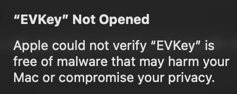

# remove gatekeeper

> this trick applies to macOS users only



```bash
sudo xattr -r -d com.apple.quarantine /Applications/EVKey.app
```

Explanation:

- xattr manages extended attributes.
- `com.apple.quarantine` is the flag Gatekeeper sets when an app is downloaded from the internet.
- Removing it tells macOS to stop warning.
