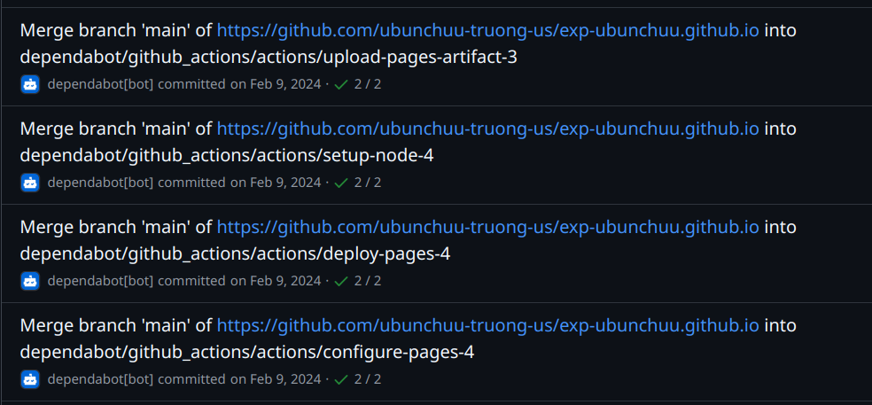

# using git bot in CI workflow

> this works for any CI/CD tool, but I will use GitHub Actions as an example.

## use case

To commit or make changes to the repository without human intervention, we can use Bot account. Simply create a new account and give it access to the repository.

> For example my use case is to merge branches using bot account.



## git configuration

Here is some bot configuration I often use:

- `github-actions[bot]`
    ```bash
    git config --global user.name github-actions[bot]
    git config --global user.email 41898282+github-actions[bot]@users.noreply.github.com
    ```

> Source (GitHub API): [https://api.github.com/users/github-actions[bot]/events/public](https://api.github.com/users/github-actions[bot]/events/public)

- `dependabot[bot]`
    ```bash
    git config --global user.name dependabot[bot]
    git config --global user.email 49699333+dependabot[bot]@users.noreply.github.com
    ```

> Source (GitHub API): [https://api.github.com/users/dependabot[bot]/events/public](https://api.github.com/users/dependabot[bot]/events/public) 

- `or any other bot of your organization`

Then you can interact with the repository as a bot.

# add bot config as a step in CI workflow

for example with GitHub Actions:

```yaml
- name: Configure Bot Git Credentials
  run: |
    git config --global user.name github-actions[bot]
    git config --global user.email 41898282+github-actions[bot]@users.noreply.github.com
```
