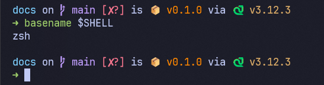

# starship prompt

## setup starship prompt

```bash
curl -sS https://starship.rs/install.sh | sh
echo 'eval "$(starship init zsh)"' >> ~/.$(basename $SHELL)rc
```

## arrow prompt with starship



run this:

```bash
mkdir -p ~/.config/
cat <<EOF > ~/.config/starship.toml
[character] # The name of the module we are configuring is 'character'
success_symbol = '[➜](bold green)'
error_symbol = '[➜](bold red)'
vicmd_symbol = '[➜](blue)'
EOF
```
