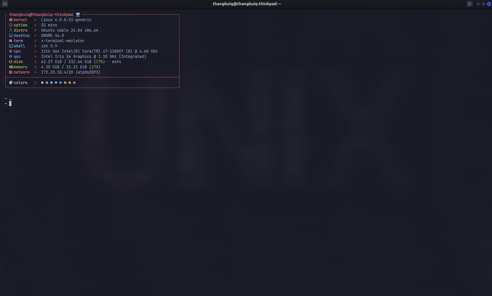

# ghostty terminal

## install in 1 block

```bash
source /etc/os-release
GHOSTTY_DEB_URL=$(
   curl -s https://api.github.com/repos/mkasberg/ghostty-ubuntu/releases/latest | \
   grep -oP "https://github.com/mkasberg/ghostty-ubuntu/releases/download/[^\s/]+/ghostty_[^\s/_]+_amd64_${VERSION_ID}.deb"
)
GHOSTTY_DEB_FILE=$(basename "$GHOSTTY_DEB_URL")
curl -LO "$GHOSTTY_DEB_URL"
sudo dpkg -i "$GHOSTTY_DEB_FILE"
rm "$GHOSTTY_DEB_FILE"
```

## set as default terminal

```bash
sudo update-alternatives --install /usr/bin/x-terminal-emulator x-terminal-emulator $(which ghostty) 50
sudo update-alternatives --set x-terminal-emulator $(which ghostty)
```

## config to ghostty

Open `~/.config/ghostty/config` and edit to config:

```bash
theme = tokyonight
font-size = 13
font-family = JetBrainsMono Nerd Font # change to your own font
shell-integration-features = no-cursor,no-title
cursor-style = block
background-opacity = 0.965

mouse-hide-while-typing = true
mouse-scroll-multiplier = 2

window-theme = ghostty
window-width = 1280
window-height = 720
window-padding-x = 15
window-padding-y = 10
window-decoration = true

window-colorspace = "display-p3"
gtk-adwaita = false
gtk-titlebar = true
adw-toolbar-style = "flat"
bold-is-bright = true
```
Example of the above ghostty config:

